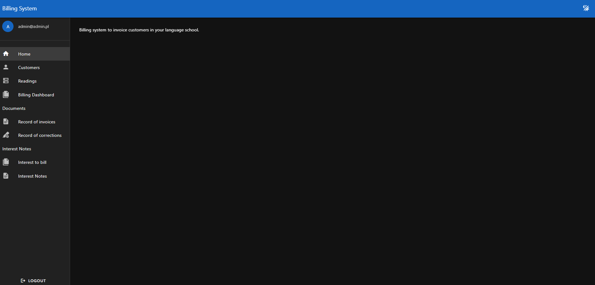
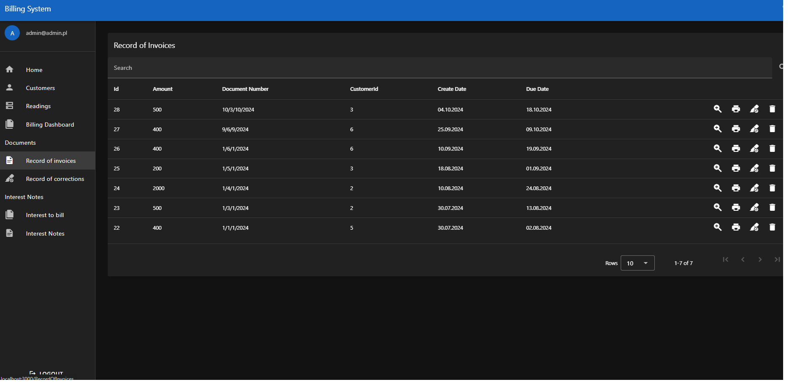
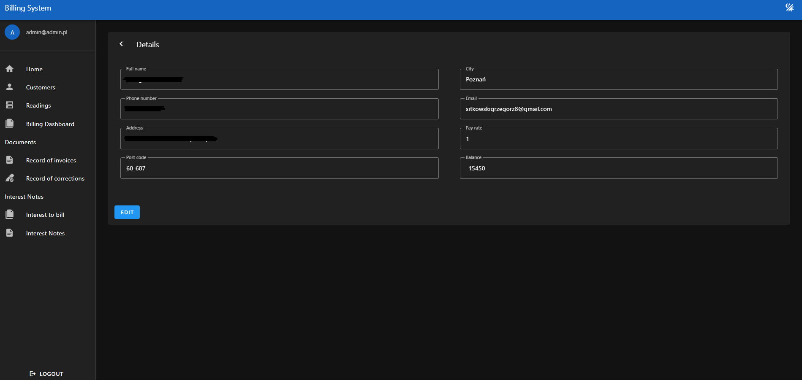
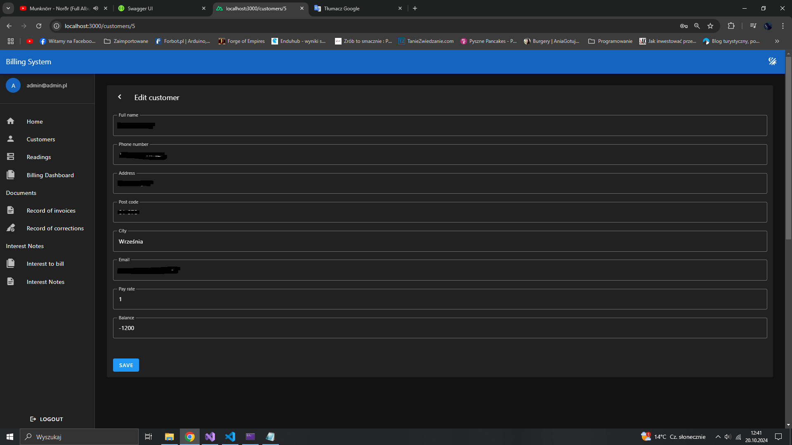
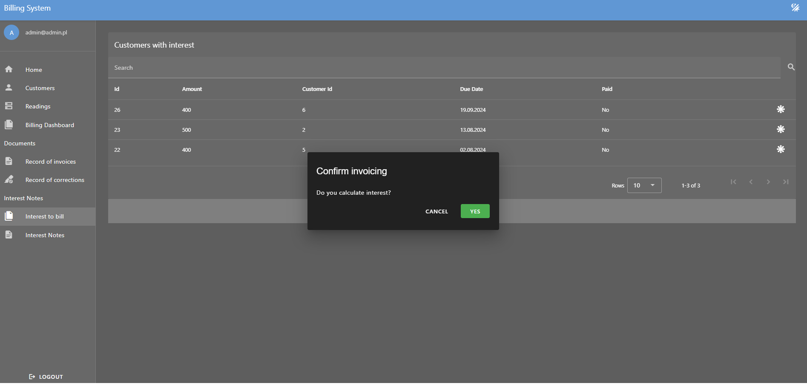

# Billing system - frontend
> Web application to billing customers in you language school. 

## Table of contents
* [General info](#general-info)
* [Technologies](#technologies)
* [Status](#status)
* [Sreenshots](#screenshots)

## General info
Application to invoice customers.

## Technologies
* Vue.js
* Vuetify.js

## Screenshots
### Main page

### Example list of records

### Example page of details

### Example edit of record

### Invoicing

## Status
WORK IN PROGRESS. I work for options to insert payments of customers and load data from file. 

More details:
https://github.com/GrzegorzSitkowski/BillingSystem-Backend
https://github.com/GrzegorzSitkowski/BillingSystem-Database
